# Google-Cloud-Big-Data-Project

## Overview
### Team Members 
1. Rabita Bhuiya Tanaya
2. Han Maliya
3. Wan Nurul Adibah binti Wan Tarmizi
4. Su Geer


### Background and Problem Statement  
The escalating prevalence of chronic diseases has created an urgent need for advanced data analytics in healthcare (World Health Organization [WHO], 2024). Despite the critical importance of timely intervention, existing systems are ill-equipped to manage the volume and complexity of modern medical data (Javaid et al., 2022). The absence of an efficient, cloud-based infrastructure hinders the rapid analysis required for accurate risk prediction and patient stratification. Consequently, developing a robust cloud data lifecycle framework is necessary to transform raw medical data into actionable insights, bridging the gap between massive data accumulation and effective clinical decision-making.

### Project Objectives
The objectives of this project are as follows:
1.	Select a suitable healthcare dataset related to chronic disease prediction or risk analysis.
2.	Design a cloud-based data analytics framework covering ingestion, storage, processing, analytics, and visualization layers.
3.	Select appropriate tools for each layer and provide clear justifications.
4.	Implement at least 30% of the framework using two or more data engineering tools.
5.	Evaluate the implemented framework using key performance metrics, including processing speed, throughput, and scalability.
6.	Present analytical findings to support potential decision-making in the healthcare domain.


## Dataset used

### Reasons for selecting the dataset

The Diabetes Prediction Dataset was selected as the optimal choice for this project due to its balance of manageability, structure, and clinical relevance. With approximately 1,000 samples, it offers an ideal size for demonstrating cloud scalability and efficient processing on platforms like AWS or Azure without the resource overhead of massive datasets. Its clean, structured format with essential clinical features—such as glucose levels and BMI—minimizes preprocessing time, allowing for the direct application of machine learning tools like Spark MLlib. Furthermore, the dataset aligns perfectly with the project’s healthcare analytics objectives, providing an interpretable foundation for building predictive models and visualizing risk factors within the constraints of a teaching environment.

- Dataset ： Diabetes Prediction Dataset
-  https://www.kaggle.com/datasets/iammustafatz/diabetes-prediction-dataset


## Conceptual Framework and Architecture Diagram
<div align="center">
  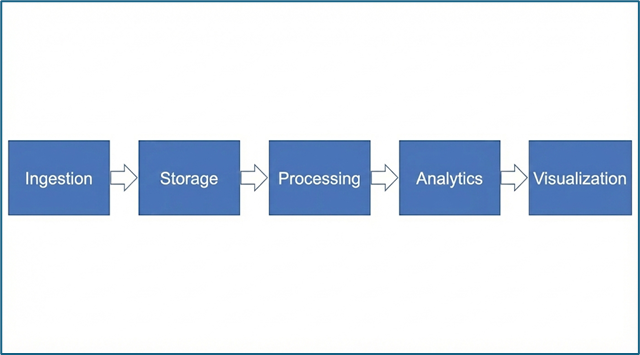
</div>

 
Explanation of Framework Layers:
-	Ingestion Layer:

    This layer acts as the centralized entry point for the pipeline, responsible for identifying and transporting data from external silos (third-party databases, APIs, or servers) into the internal cloud environment via Batch or Streaming methods (Kleppmann, 2017). By handling the handover from "outside" to "inside," it bridges the gap between inaccessible external sources and internal processing power, ensuring the pipeline always has the necessary raw material to operate (P. Gatwiri, 2018).
-	Storage Layer (Data Lake):
    
    The Storage Layer serves as a scalable repository using an "Object Storage" architecture to hold data in its "Raw" (original format) and "Curated" (staged) zones (Laurent, 2016). It decouples storage from computing power to create a safe "landing zone." This ensures an immutable backup of source files is preserved before processing, protecting against data loss caused by processing errors and allowing for historical data lineage (Inmon, 2016). 
-	Processing Layer (ETL):
    
    This layer executes "Extract, Transform, and Load" (ETL) logic to clean, deduplicate, and structure messy raw data into a usable format. Because raw data often contains null values and inconsistencies that lead to inaccurate machine learning predictions (the "Garbage In, Garbage Out" principle), this layer is critical for ensuring data quality and reliability before analysis begins (Do, 2000).
-	Analytics & Warehousing Layer:
    
    Functioning as the OLAP (Online Analytical Processing) engine, this layer organizes cleaned data into structured tables optimized for high-speed querying and complex aggregations. It bridges the gap between static files and actionable intelligence by providing the performance necessary to run algorithms and train Machine Learning models, which the slower Storage Layer cannot efficiently handle (Ross, 2013).
-	Visualization Layer:
    
    The Visualization or Business Intelligence (BI) layer consumes analytical results to generate graphical interfaces like charts and summary cards (Ware, 2012). It translates complex model outputs and database tables which are often difficult for non-technical stakeholders to interpret into clear visual insights that support immediate decision-making.


## Tools Selection

<div align="center">
  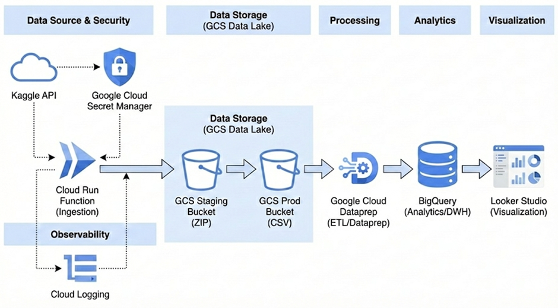
</div>
 
- Data Ingestion — Google Cloud APIs & Cloud Run

    We selected Google Cloud Run for data ingestion because of its fully managed, serverless execution model. This approach allows the system to scale automatically based on workload without the need for infrastructure maintenance. According to Google Cloud (2024), serverless architecture significantly reduces operational overhead, enabling developers to focus on code rather than server management. In our framework, Cloud Run securely invokes the Kaggle API to retrieve the Diabetes Prediction dataset. Simultaneously, Google Cloud Secret Manager handles API credentials to ensure secure authentication. Finally, the raw ZIP files are ingested directly into a Google Cloud Storage (GCS) staging bucket, creating a secure and automated entry point for the pipeline.
- Data Storage — Google Cloud Storage (GCS)

    Google Cloud Storage (GCS) acts as our primary data lake due to its high durability and cost efficiency. Crucially, GCS architecture enables the decoupling of storage from compute, allowing our system to scale storage capacity independently of processing power. As stated in the Google Cloud Architecture Framework (2024), this decoupled approach provides significant cost savings and flexibility, as we only pay for the storage we use without maintaining idle compute resources. The storage layer is organized into two logical zones: a staging bucket for raw compressed files and a production bucket for extracted CSV datasets. Furthermore, GCS’s seamless integration with BigQuery and Dataprep reduces operational complexity across the pipeline.  
                                                                                                                                                  
- Data Processing – Google Cloud Dataprep
    
    We selected Google Cloud Dataprep for this task because it is an intelligent, serverless data service that integrates natively with our Google Cloud ecosystem. Unlike traditional ETL tools that require infrastructure management, Dataprep automatically scales on demand. For the Diabetes Prediction dataset, we utilize its predictive transformation feature to identify and fix data quality issues—such as missing values in the BMI column or inconsistent formatting in smoking history—without writing complex code. According to Google Cloud (2024), Dataprep accelerates the analytics lifecycle by providing visual data exploration and seamless connectivity between Google Cloud Storage (GCS) and BigQuery, ensuring a streamlined pipeline from ingestion to warehousing.

- Data Analytics — Google BigQuery

    Google BigQuery was selected as the data warehousing layer because of its serverless, columnar architecture, which is specifically optimized for OLAP (Online Analytical Processing) workloads. As noted by Google (2023), BigQuery’s distributed architecture enables rapid execution of complex queries on large datasets without requiring cluster management. For our diabetes dataset, this scalability facilitates deep feature exploration and population-level trend analysis. Moreover, BigQuery adheres to strict security standards, including IAM-based access control, which is essential for protecting sensitive healthcare information. It also integrates natively with Looker Studio, ensuring a smooth transition from analysis to visualization.

- Data Visualisation — Looker Studio

    Looker Studio is used as the visualization layer due to its real-time connectivity with BigQuery and its ability to produce interactive dashboards without requiring advanced technical skills. This accessibility is crucial for healthcare projects where clinicians or decision-makers need to interpret complex data quickly. Prasiwiningrum (2023) demonstrated that utilizing Looker Studio for projecting and visualizing health workforce data significantly enhances planning and decision-making capabilities in the healthcare sector. Consequently, our dashboard employs Looker Studio’s dynamic filtering and drill-down features to support the detailed analysis of diabetes risk factors, population trends, and outcome distributions.

## Implementation of the Proposed Framework
### Project Setup — Access Across Team Members
	Prerequisites:
1.	Kaggle account with API access.
2.	Google Cloud Shell
3.	Google Cloud account
4.	Created Google Cloud Storage Bucket
Roles and permission were assigned to team member in IAM, providing access to resources.
 
5.2 Data Ingestion — Google Cloud APIs & Cloud Run
Step 1: Env Setup
Cloud shell is used for the environment setup
<div align="center">
  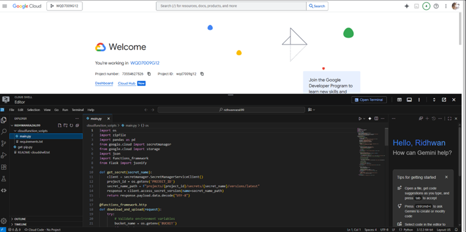
</div>

First, set up the necessary environment variables in Cloud Shell:
```bash
export PROJECT_ID=(Project Id)
export REGION=us-central1
export BUCKET=dataprep-prod
export STAGING_BUCKET=dataprep-staging
export SERVICE_ACCOUNT_EMAIL=${SERVICE_ACCOUNT}
```
 
Step 2: Configure Kaggle Authentication
Go to Kaggle Settings and click on “Create New API Token” to download the Kaggle.json
<div align="center">
  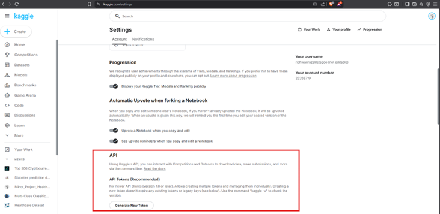
</div>

Step 3: Enable Required Google Cloud APIs
Next, we enable any required Google Cloud APIs
 
```bash
gcloud services enable storage.googleapis.com\
secretmanager.googleapis.com \
cloudfunctions.googleapis.com \
cloudbuild.googleapis.com \
run.googleapis.com \
logging.googleapis.com
```


Step 4: Set Up Secret Manager
The API was securely stored in the secret manager to maintain the API confidentiality by storing the Kaggle.json earlier in secret manager. This API token would be used by our function later for data retrieval step.

<div align="center">
  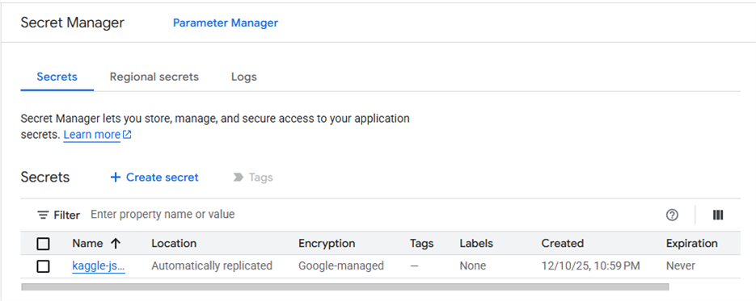
</div>
 
Add require permission for the service account to access secret manager in Cloud Shell
 ```bash
gcloud projects add-iam-policy-binding ${PROJECT_ID} \
--member=serviceAccount:${SERVICE_ACCOUNT_EMAIL} \
--role=roles/secretmanager.secretAccessor
```
Step 5: Create Cloud Function Files for data retrieval/ingestion
Create a directory for the Cloud Function.
Create requirements.txt with below dependencies.
 
```bash
functions-framework==3.*
google-cloud-secret-manager
google-cloud-storage
kaggle
flask
pandas
```


Create main.py
Added the Python code for the Cloud Function as below.
 ```python
import os
import zipfile
import pandas as pd
from google.cloud import secretmanager
from google.cloud import storage
import json
import functions_framework
from flask import jsonify

def get_secret(secret_name):
    client = secretmanager.SecretManagerServiceClient()
    project_id = os.getenv('PROJECT_ID')
    secret_name_path = f"projects/{project_id}/secrets/{secret_name}/versions/latest"
    response = client.access_secret_version(name=secret_name_path)
    return response.payload.data.decode("UTF-8")

@functions_framework.http
def download_and_upload(request):
    try:
        # Validate environment variables
        bucket_name = os.getenv('BUCKET')
        if not bucket_name:
            return jsonify({'error': 'BUCKET environment variable not set'}), 500

        dataset_name = 'iammustafatz/diabetes-prediction-dataset'
        local_zip_path = '/tmp/diabetes_prediction.zip'
        csv_filename = 'diabetes_prediction_dataset.csv'
        local_csv_path = os.path.join('/tmp', csv_filename)
        gcs_path = 'dataset/diabetes_prediction_dataset.csv'

        # Define new header names
        new_headers = [
            "gender", "age", "hypertension", "heart_disease", "smoking_history", "bmi",
            "HbA1c_level", "blood_glucose_level", "diabetes"
        ]

        # Get Kaggle credentials
        try:
            kaggle_creds = json.loads(get_secret("kaggle-json"))
            os.environ['KAGGLE_USERNAME'] = kaggle_creds['username']
            os.environ['KAGGLE_KEY'] = kaggle_creds['key']
            
            # Import kaggle after setting credentials
            import kaggle
            
        except Exception as e:
            return jsonify({'error': f'Failed to get Kaggle credentials: {str(e)}'}), 500

        # Download from Kaggle
        try:
            print("Starting dataset download...")
            kaggle.api.dataset_download_files(dataset_name, path='/tmp', unzip=True)
            print("Dataset downloaded successfully")

            # Check if the CSV file exists after extraction
            if not os.path.exists(local_csv_path):
                return jsonify({'error': f'{csv_filename} not found in {local_zip_path} after extraction'}), 500

            print("Files in /tmp:", os.listdir('/tmp'))  # List files in /tmp for debugging

            # Read the CSV and update headers
            df = pd.read_csv(local_csv_path)

            # Check if the CSV columns exist
            if len(df.columns) != len(new_headers):
                return jsonify({'error': f"CSV file has {len(df.columns)} columns, expected {len(new_headers)}"}), 500

            # Rename the columns
            df.columns = new_headers

            # Save the modified CSV
            df.to_csv(local_csv_path, index=False)
            print(f"Headers updated in {local_csv_path}")

        except Exception as e:
            return jsonify({'error': f'Failed to download or modify the CSV: {str(e)}'}), 500

        # Upload to GCS
        try:
            client = storage.Client()
            bucket = client.get_bucket(bucket_name)
            blob = bucket.blob(gcs_path)

            # Upload the modified CSV file
            blob.upload_from_filename(local_csv_path)
            print(f"Dataset uploaded to gs://{bucket_name}/{gcs_path}")
        except Exception as e:
            return jsonify({'error': f'Failed to upload to GCS: {str(e)}'}), 500

        return jsonify({
            'status': 'success',
            'message': 'Download, modification, and upload completed successfully',
            'destination': f'gs://{bucket_name}/{gcs_path}'
        }), 200

    except Exception as e:
        return jsonify({'error': f'Unexpected error: {str(e)}'}), 500

```
 
https://github.com/ridhwanrazaliwork/Google-Cloud-Big-Data-Project/blob/main/ingestion-stage-google-cloud-function.py

The Cloud Function performs the following operations:
1.	Authenticates with Kaggle using stored credentials
2.	Downloads the specified dataset
3.	Updates the CSV headers to standardized names
4.	Uploads the processed file to Google Cloud Storage

Step 6: Deploy the Cloud Function
We run the command to execute the cloud function we have created earlier in the Cloud Shell.
  ```bash
gcloud functions deploy download_and_upload \
--runtime python310 \
--trigger-http \
--allow-unauthenticated \
--region ${REGION} \
--source ./cloudfunction_scripts \
--set-env-vars PROJECT_ID=${PROJECT_ID},BUCKET=${BUCKET} \
--timeout=540s \
--memory=1024MB
```

The script will be deployed to the Cloud Run Function after few mins.
<div align="center">
  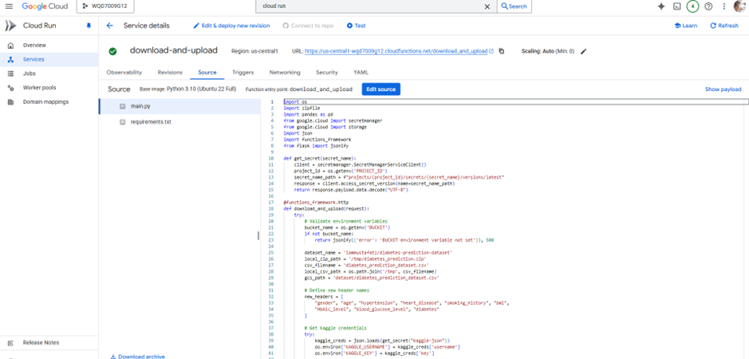
</div>


Step 7: Execute the Cloud Function
Execute the Cloud Function by using below command
   ```bash
curl "https://${REGION}-${PROJECT_ID}.cloudfunctions.net/download_and_upload?bucket-name=${BUCKET}"
```

5.3 Data Storage — Google Cloud Storage (GCS)

After some time in the Cloud Storage, you will see the dataset be downloaded.
<div align="center">
  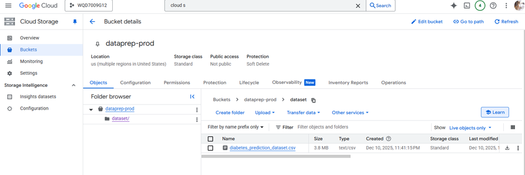
</div>

5.4 Data Transformation — Google Cloud Dataprep
	For Data transformation Dataprep tool is chosen.
The data from GCS was preprocessed using Dataprep, Dataprep provides and easy seamless connectivity to transform data from GCS and output to BigQuery for further analysis.
The dataset was uploaded in the Dataprep environment, and data wrangling is done by adding a node called “Recipe”, a final node “Output” was added to export the dataset to BigQuery.
<div align="center">
  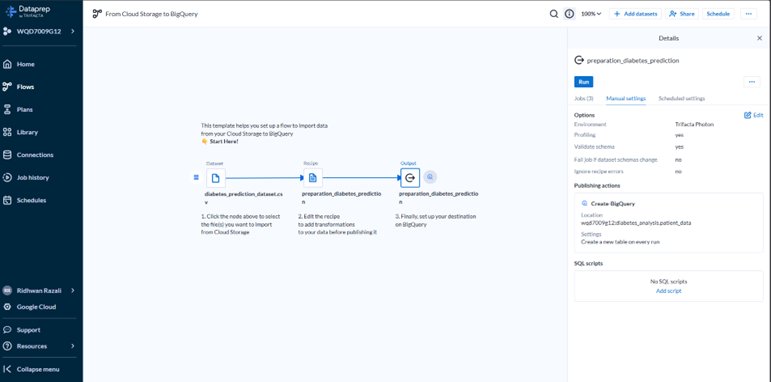
</div>

Dataprep provides an easy-to-use interface for exploring datasets and it also automatically summarize our dataset contents, identifies missing values, and even suggest potential transformations for us. By clicking any column in the table, we can quickly gain insights from the data.
Several steps were taken to transform the data, such as converting text in gender, smoking history columns to lowercase, renaming columns, standardize smoking history column.
<div align="center">
  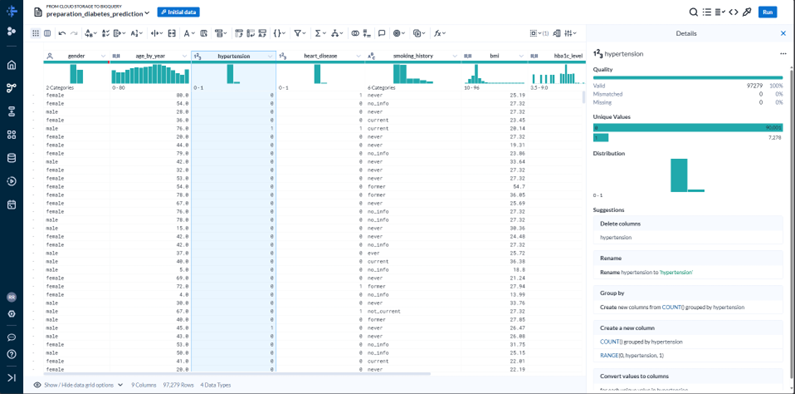
</div>

After the data transformation, it was exported to BigQuery table for further analysis. The transfer process time taken to BigQuery in table format were 19 seconds.
<div align="center">
  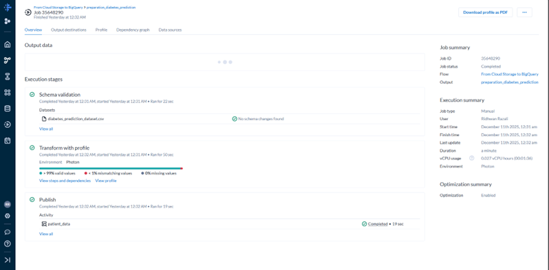
</div>

The output can be seen in Google BigQuery table.
<div align="center">
  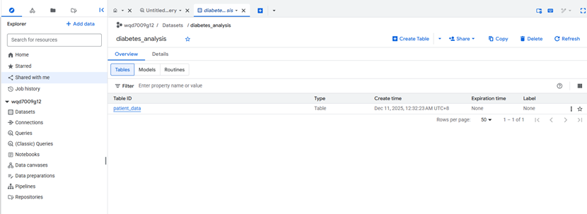
</div>

 
5.5 Data Analytics — Google BigQuery

BigQuery was used to execute SQL queries for summarizing patient records, calculating averages of key clinical indicators, and categorizing HbA1c, glucose, BMI, and diabetes status. These analytical queries provided the aggregated results required for dashboard visualization and clinical risk analysis.

BigQuery table diabetes_analysis.patient_data showing the successfully loaded and curated diabetes dataset used for analytical querying and visualization.
<div align="center">
  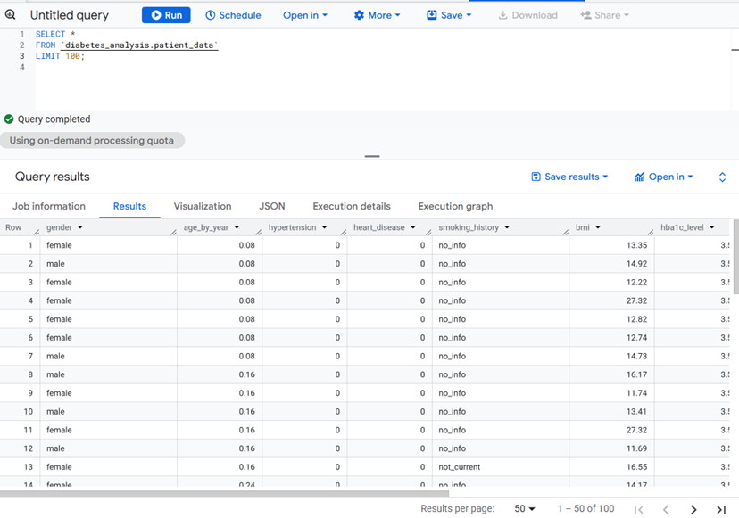
</div>

SQL query executed in BigQuery to verify total number of records, confirming successful data ingestion and availability for analytics.
<div align="center">
  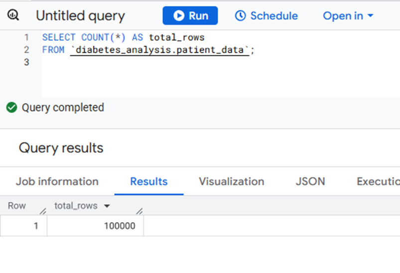
</div>

BigQuery query computing average values of key clinical indicators (HbA1c, glucose, BMI, and age) to support population-level analysis.
<div align="center">
  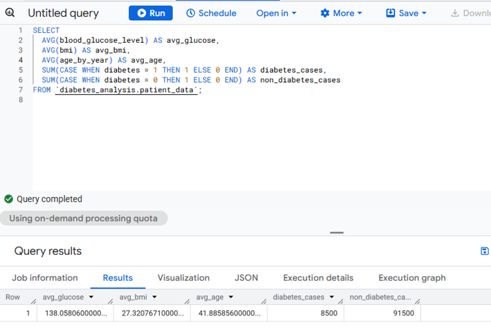
</div>

SQL query used to aggregate patient counts by diabetes status, forming the basis for prevalence analysis and dashboard visualization.
<div align="center">
  
</div>

Query summarizing patient count by gender.
<div align="center">
  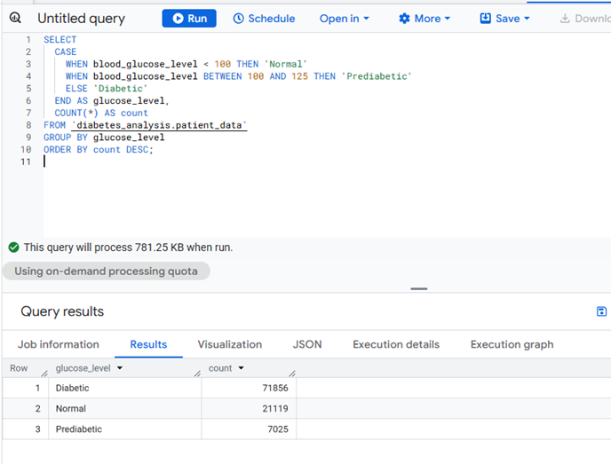
</div>

This query computes Pearson correlation coefficients between age, BMI, blood glucose level, and diabetes outcome to examine the strength of relationships among key clinical risk factors.
<div align="center">
  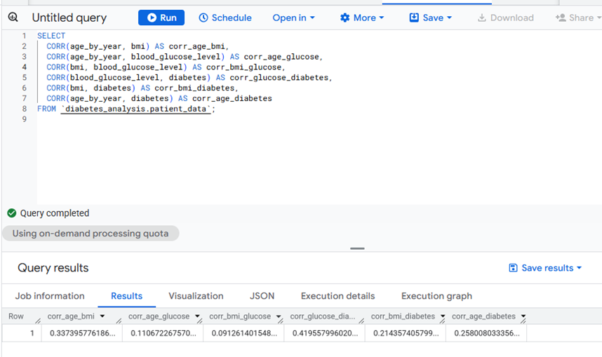
</div>

This query analysing glucose categories across patient age groups.
<div align="center">
  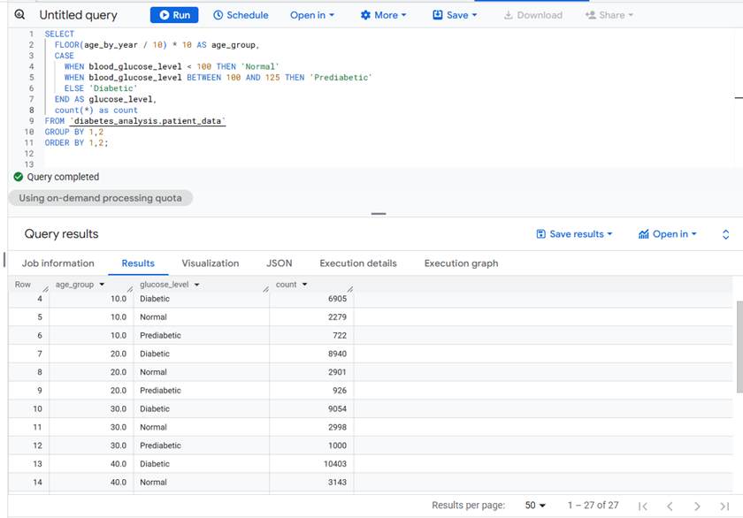
</div>

5.6 Data Visualisation — Looker Studio
Looker Studio dashboards were used to visualize demographic and clinical risk insights derived from BigQuery analytics.
This dashboard page below reveals a predominantly overweight adult population with a high proportion of prediabetic and medium-risk patients, highlighting the need for early diabetes prevention and risk monitoring.
<div align="center">
  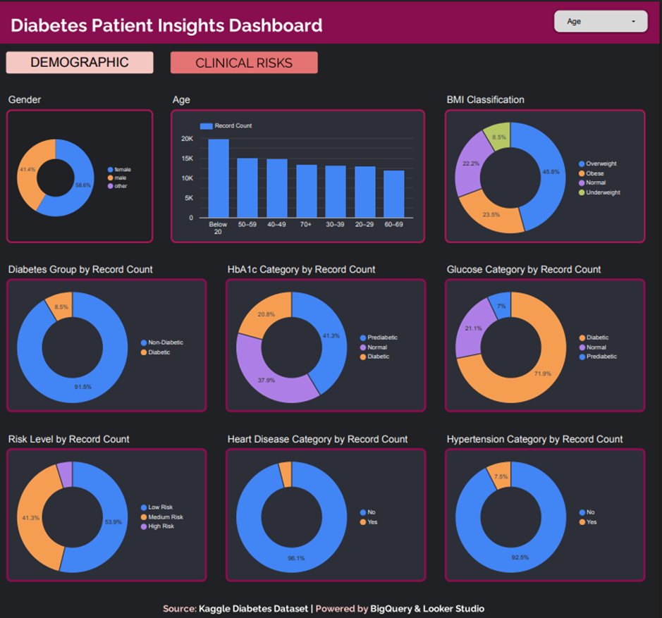
</div>

Below shows an overweight population with elevated average glucose levels, indicating obesity as a key contributing risk factor. Although only 8.5% of patients are diabetic and 4.79% are classified as high risk, a large proportion fall within prediabetic and medium-risk categories. This highlights the importance of early monitoring and preventive intervention to reduce future diabetes progression.
<div align="center">
  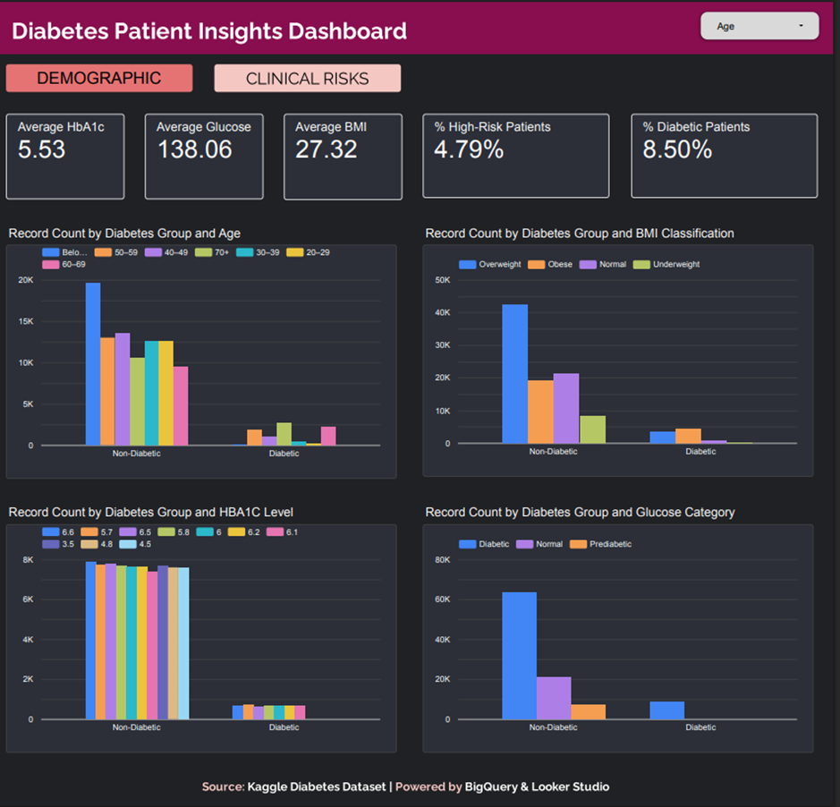
</div>

Direct link to the dashboard: https://lookerstudio.google.com/reporting/73c5d0ba-f968-404e-bf45-6ebaa634dc49 

 
6. Framework Evaluation and Metrics 
6.1 Selection of Performance Metrics  
In this part, the three metrics we chose to judge the cloud based big data infrastructure are Query processing speed, Fault tolerance, and data pipeline efficiency. The goal is to find out how well Google Cloud services handle data, fix problems, and keep the analytics pipeline running smoothly.
We chose these measures because they show how healthcare data is really processed in the real world, where quick execution, dependability, and effective resource use are all important for making accurate decisions and analytics.
6.2 Performance Analysis
Metric 1 Analysis: Processing Speed (Query Processing Speed):
Query and Result for Metric 1:
<div align="center">
  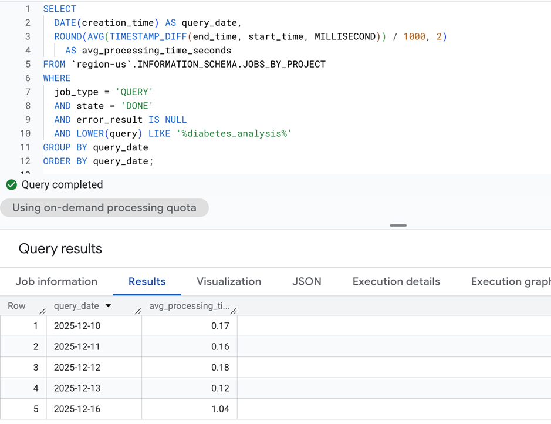
</div>

Graph shows that the average time it takes to answer queries is less than one second on most days. This means that the system can process a lot of queries at once and yet answer them fast. There is a small rise on one day, but overall performance is good. This shows that BigQuery can handle the data well and can execute both real-time and batch analysis without any noticeable delays.
<div align="center">
  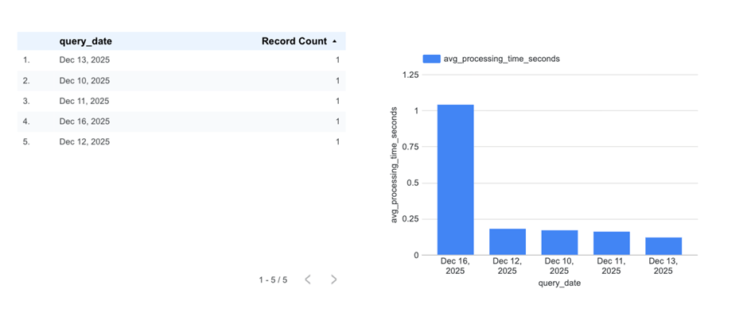
</div>

 Figure: Bar Chart showing Query Date Vs Query Processing Speed

Metric 2 Analysis: Fault Tolerance:
We looked at the diabetes dataset's rates of success and failure to see how fault tolerant the query was.  The study achieved a 100% success rate, with no failures or errors.

<div align="center">
  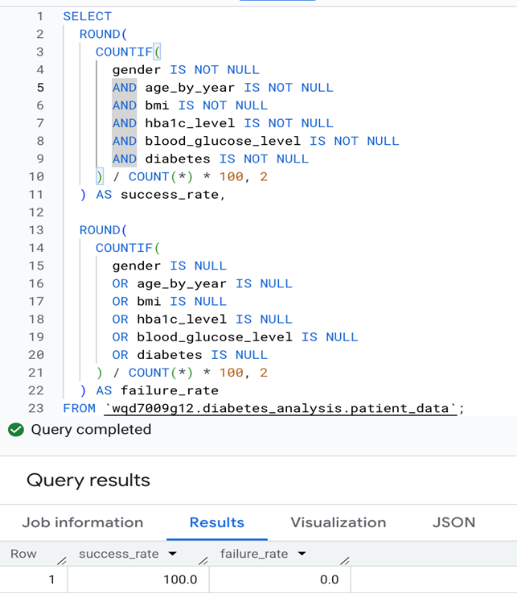
</div>
<div align="center">
  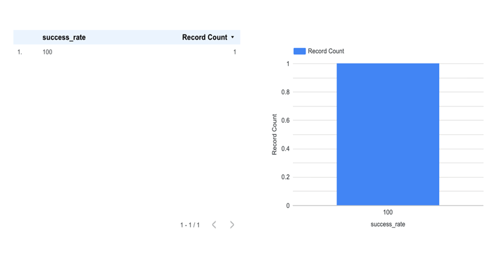
</div>


 
Figure: Bar Chart showing 100% Success Rate for a Query

Metric 3 Analysis:  Data pipeline Efficiency:
The data pipeline is efficient because queries run very quickly, with an average processing time of about 0.26 seconds. Each query processes a small amount of data (around 0.82 MB), showing that resources are used efficiently. The high success rate of 97.45% means most queries complete without errors. Overall, this indicates that the pipeline works smoothly, uses resources wisely, and delivers reliable performance.
<div align="center">
  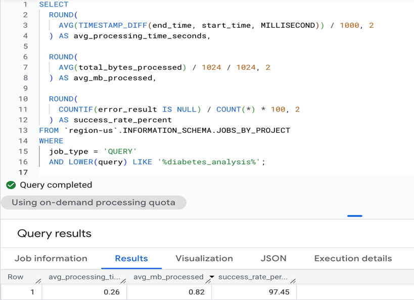
</div>
<div align="center">
  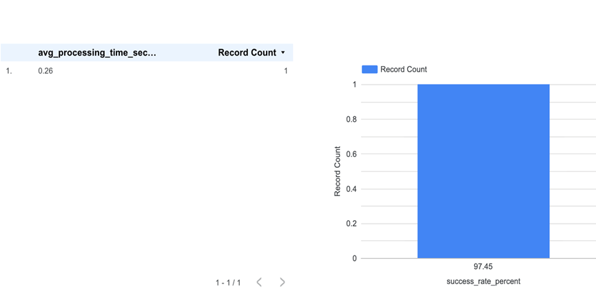
</div>

 
 
Figure: Data Pipeline working efficiently with 97.45% success rate

7. Conclusion
In short, all our objectives have been met.
First, we effectively integrated BigQuery for clinical SQL analysis and Looker Studio for risk visualization.
Second, the analysis yielded critical health insights:
-	Risk Profile: A large portion of the population is prediabetic, despite a low active diabetes rate (8.5%).
-	Key Drivers: Obesity was identified as a primary factor, highlighting the urgent need for early preventive intervention.
Finally, the infrastructure evaluation confirmed high system performance:
-	Speed & Efficiency: Queries averaged under 0.26 seconds with minimal resource usage.
-	Reliability: The pipeline maintained a success rate exceeding 97%, ensuring dependable real-time analytics. 

## References
1.	Do, E. R. a. H. H. (2000). Data Cleaning: Problems and Current Approaches. IEEE Data Engineering Bulletin.  
2.	Inmon, B. (2016). Data Lake Architecture: Designing the Data Lake and Avoiding the Garbage Dump.  
3.	Kleppmann, M. (2017). Designing Data-Intensive Applications: The Big Ideas Behind Reliable, Scalable, and Maintainable Systems. O'Reilly Media.  
4.	Laurent, C. M. a. A. (2016). The Next Generation of Data Warehouses: A Survey on the Data Lake. the 20th International Database Engineering & Applications Symposium.  
5.	P. Gatwiri, K. L., and A. Rodrigues. (2018). Data Ingestion Frameworks: A Survey. International Journal of Computer Applications Technology and Research, 179.  
6.	Ross, R. K. a. M. (2013). The Data Warehouse Toolkit: The Definitive Guide to Dimensional Modeling. Wiley.  
7.	Ware, C. (2012). Information Visualization: Perception for Design. Morgan Kaufmann.  
8.	Javaid, M., Haleem, A., Singh, R. P., & Suman, R. (2022). Artificial intelligence applications for industry 4.0: A literature-based study. Journal of Industrial Integration and Management, 7(01), 83-111.
